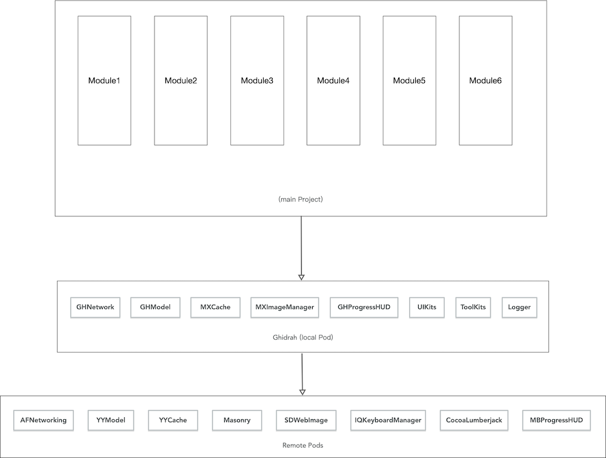
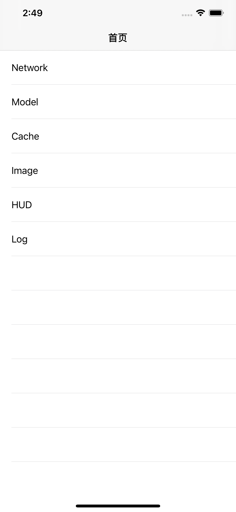

# Ghidrah
### 简介
把CocoaPods上底层功能模块库封装成基础模块中间层，便于模块化开发。

- ✅ Model层，基于`YYModel`。
- ✅ HUD层，基于`MBProgressHUD`。
- ✅ Category层，收集的Category方法。
- ✅ Tool层，基于`CocoaLumberjack`的Log打印与本地日志生成。
- ✅ 网络层，`GHNetwork`
- ✅ 缓存层，`MXCaches`
- ✅ 图片处理，`MXImageManager` 
- ✅ 其他，`Masonry`，`IQKeyboardManager`



### 安装要求

```
iOS 11.0

pod 'Ghidrah', :git => 'ssh://git@192.168.16.172:7999/em/ghidrah.git' // 配置在本地服务器
```

### 使用
#### 启动配置

```
# Appdelegate.m
#import <Ghidrah/GHLaunchConfig.h>
#import "EMNetworkHandler.h"
#import <CocoaLumberjack/CocoaLumberjack.h>
#import <MXCaches/MXCache.h>
#import <MXImageManager/MXImageCache.h>

[GHLaunchConfig gh_launch];
[GHLaunchConfig gh_setupNetwork:@"http://192.168.16.197:9093/"
                       security:nil
                       delegate:[EMNetworkHandler handler]];
                       
 // 缓存初始化
[[MXCache sharedCache] mx_setCachePath:@""];
[[MXCache sharedCache] mx_mCacheCount:100 mExpirytime:600 dExpirytime:86400];
    
// 图片缓存设置
[MXImageCache mx_cancelSDMemoryCache];
```
#### Demo


